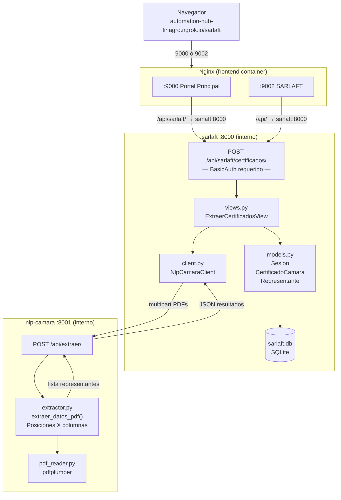
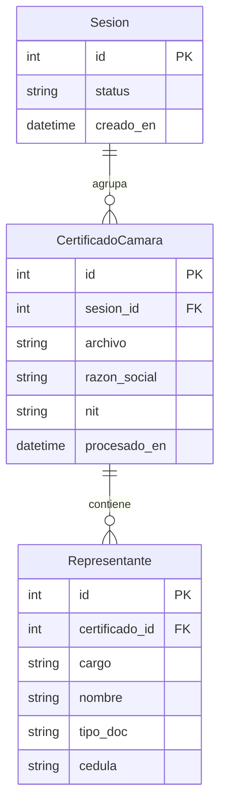

# Servicio SARLAFT — Documentación Técnica

> **Fecha de creación:** Marzo 2026
> **Versión:** 2.0 — Migración a servicio independiente

---

## 1. Descripción General

El servicio SARLAFT extrae automáticamente los datos de personas naturales y jurídicas
listadas en los **Certificados de Existencia y Representación Legal** de la Cámara de
Comercio, para su posterior cruce con listas restrictivas en el proceso LA/FT.

Desde Marzo 2026 opera como un **servicio Django independiente** dentro de la red Docker
de Finagro, desacoplado del backend principal (`automation-hub-finagro`).

---

## 2. Arquitectura del Servicio



---

## 3. Estructura de Archivos

```
Finagro/sarlaft/
├── backend/
│   ├── core/
│   │   ├── settings.py      — Django config (SQLite, DRF, CORS)
│   │   ├── urls.py          — path('api/sarlaft/', include('sarlaft_app.urls'))
│   │   └── wsgi.py
│   ├── sarlaft_app/
│   │   ├── models.py        — Sesion, CertificadoCamara, Representante
│   │   ├── serializers.py   — CertificadoCamaraSerializer (nested Representante)
│   │   ├── views.py         — ExtraerCertificadosView (POST)
│   │   ├── client.py        — NlpCamaraClient → nlp-camara:8001
│   │   ├── admin.py         — Admin con inlines
│   │   └── migrations/
│   │       └── 0001_initial.py
│   ├── manage.py
│   └── requirements.txt
├── docker/
│   └── Dockerfile           — python:3.12-slim + gunicorn
└── docker-compose.yml       — standalone dev (puerto 8003)
```

---

## 4. Modelo de Datos



### Diferencias respecto a la versión anterior

| Campo | Versión 1 (módulo en backend) | Versión 2 (servicio independiente) |
|---|---|---|
| Trazabilidad | FK a `execution.Execution` | `Sesion` propio (sin telemetría externa) |
| Representantes | Un único campo `representante` | Tabla `Representante` con `cargo`, `nombre`, `tipo_doc`, `cedula` |
| Base de datos | PostgreSQL compartida con backend | SQLite dedicada (`sarlaft.db`) |
| Autenticación | Usuarios de Django principal | Usuarios propios del servicio |

---

## 5. API

### `POST /api/sarlaft/certificados/`

**Autenticación:** HTTP Basic Auth (usuario del servicio SARLAFT)

**Request:**
```
Content-Type: multipart/form-data
Authorization: Basic <base64(usuario:contraseña)>

archivos = <certificado1.pdf>
archivos = <certificado2.pdf>
...
```

**Response `201 Created`:**
```json
{
  "execution_id": 1,
  "resultados": [
    {
      "id": 1,
      "sesion": 1,
      "archivo": "CAMARA DE COMERCIO EMPRESA XYZ.pdf",
      "razon_social": "EMPRESA XYZ S A S",
      "nit": "900123456-7",
      "procesado_en": "2026-03-26T15:51:58Z",
      "representantes": [
        {
          "id": 1,
          "cargo": "Gerente",
          "nombre": "Juan Carlos Pérez García",
          "tipo_doc": "C.C.",
          "cedula": "12345678"
        },
        {
          "id": 2,
          "cargo": "Primer Suplente Del Gerente",
          "nombre": "María López Rodríguez",
          "tipo_doc": "C.C.",
          "cedula": "87654321"
        },
        {
          "id": 3,
          "cargo": "Miembro Junta Directiva - Primer Renglon",
          "nombre": "John Smith",
          "tipo_doc": "P.P.",
          "cedula": "AB123456"
        },
        {
          "id": 4,
          "cargo": "Revisor Fiscal Principal",
          "nombre": "Ana Gómez Vargas",
          "tipo_doc": "C.C.",
          "cedula": "55443322 / T.P. 123456-T"
        }
      ]
    }
  ],
  "errores": []
}
```

**Errores posibles:**

| Código | Causa |
|---|---|
| `400` | No se enviaron archivos |
| `401` / `403` | Credenciales inválidas |
| `502` | Servicio `nlp-camara` no disponible |

---

## 6. Extractor NLP — Algoritmo de Extracción

El servicio delega la extracción al servicio `nlp-camara` (`extractor.py`), que en su
versión 2.0 usa **posiciones X de palabras** (vía `pdfplumber.extract_words()`) en lugar
de expresiones regulares sobre texto plano.

### Columnas detectadas automáticamente

```
CARGO NOMBRE IDENTIFICACIÓN
 x≈106  x≈218      x≈380
```

El extractor lee la cabecera `CARGO NOMBRE IDENTIFICACIÓN` del PDF para calibrar los
límites de columna (`col_cargo_max`, `col_nombre_max`) de forma adaptativa.

### Secciones procesadas

| Sección del PDF | Tipo de cargo generado |
|---|---|
| `REPRESENTANTES LEGALES` | Tal como aparece (Gerente, Primer Suplente Del Gerente, …) |
| `JUNTA DIRECTIVA — PRINCIPALES` | `Miembro Junta Directiva - {cargo}` |
| `JUNTA DIRECTIVA — SUPLENTES` | `Suplente Junta - {cargo}` |
| `REVISORES FISCALES` | Tal como aparece (Revisor Fiscal Principal, Revisor Fiscal Suplente, …) |

### Tipos de documento reconocidos

`C.C.` · `P.P.` · `N.I.T.` · `C.E.` · `T.P.` (como documento complementario a C.C.)

### Casos especiales manejados

- Nombres que continúan en la línea siguiente (ej. `Hernandez De Gomez`)
- Cargos multilinea (ej. `Primer / Suplente Del / Gerente`)
- NIT con dígito verificador separado por espacio (`830055030 9` → `830055030-9`)
- T.P. como documento secundario (`C.C. No. 1075320375 / T.P. 345417-T`)
- Personas jurídicas como revisores fiscales (nombre en mayúsculas en múltiples líneas)
- Párrafos de transición entre tablas (`Por Acta No…`, `Por Documento Privado No…`)

---

## 7. Configuración y Despliegue

### Variables de entorno

| Variable | Valor en producción | Descripción |
|---|---|---|
| `DEBUG` | `False` | Modo producción |
| `ALLOWED_HOSTS` | `*` | Acepta cualquier host (tráfico interno Docker) |
| `NLP_CAMARA_URL` | `http://nlp-camara:8001` | URL interna del servicio NLP |
| `SECRET_KEY` | _(definir en `.env.prod`)_ | Clave secreta Django |

### docker-compose.prod.yml (fragmento)

```yaml
sarlaft:
  build:
    context: ../sarlaft
    dockerfile: docker/Dockerfile
  environment:
    DEBUG: "False"
    ALLOWED_HOSTS: "*"
    NLP_CAMARA_URL: http://nlp-camara:8001
  volumes:
    - sarlaft_db:/app/db
  depends_on:
    - nlp-camara
  networks:
    - finagro-net
```

### Comandos operacionales

```bash
# Ver logs en tiempo real
docker compose -f docker-compose.prod.yml logs -f sarlaft

# Crear/cambiar usuario de acceso
docker compose -f docker-compose.prod.yml exec sarlaft \
  python manage.py shell -c "
from django.contrib.auth.models import User
User.objects.create_superuser('admin', 'admin@finagro.com', 'contraseña_segura')
"

docker compose -f docker-compose.prod.yml exec sarlaft \
  python manage.py changepassword admin

# Acceder al admin Django del servicio
# → http://sarlaft.ngrok.io/admin/   (puerto 9002)
# → http://automation-hub-finagro.ngrok.io/sarlaft (portal principal, puerto 9000)
```

---

## 8. Ruteo Nginx — Puerto 9000 (Portal Principal)

El bloque `/api/sarlaft/` se añadió **antes** del bloque genérico `/api/` en el server
block del puerto 9000, para que las peticiones desde el portal principal también lleguen
al servicio independiente:

```nginx
# Puerto 9000 — regla específica sarlaft (DEBE ir antes de /api/)
location /api/sarlaft/ {
    proxy_pass         http://sarlaft:8000/api/sarlaft/;
    proxy_read_timeout 120s;
    client_max_body_size 100M;
}

# Puerto 9000 — resto de API → backend Django
location /api/ {
    proxy_pass http://backend:8000/api/;
}

# Puerto 9002 — todo /api/ → sarlaft directamente
location /api/ {
    proxy_pass         http://sarlaft:8000/api/;
    client_max_body_size 100M;
}
```

---

## 9. Historial de Cambios

| Versión | Fecha | Cambio |
|---|---|---|
| 1.0 | 2026-03-09 | Módulo `modules/sarlaft` dentro del backend principal. Extrae solo el primer representante (Gerente) usando regex sobre texto plano. |
| 2.0 | 2026-03-26 | **Migración a servicio independiente** `Finagro/sarlaft/`. Nuevo extractor basado en posiciones X de columnas. Extrae todos los representantes (Gerente, suplentes, junta directiva, revisores fiscales). Modelo `Representante` separado. Ruteo nginx actualizado. |
